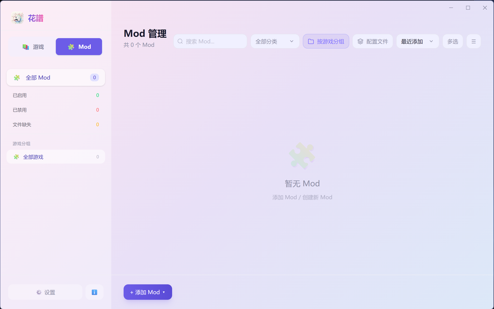

# 花譜 Floralis

[](https://github.com/Falryn/floralis/releases)
[](LICENSE)
[](https://ko-fi.com/falryn)
[](https://paypal.me/falryn)

一款面向**视觉小说与独立游戏玩家**的本地游戏库管理工具，使用 Tauri 2 + Vue 3 构建。

> 整理你的游戏库、一键启动、记录游玩时光、管理 Mod——全部离线完成，数据只属于你。

## ✨ 功能特性

- **游戏库管理**：添加、编辑、删除游戏，支持分组与标签分类，网格/列表双视图
- **智能导入**：
  - 单个压缩包：自动解压 → 预填信息 → 从 Bangumi / Steam / VNDB / IGDB 一键补全元数据与封面
  - 批量导入：解压清单 → 一键 Bangumi 匹配 → 批量入库；也支持扫描游戏根目录批量识别
- **一键启动**：支持脚本启动与参数传递，自动检测主程序
- **游玩时长统计**：后台自动追踪游戏进程、日历视图查看会话历史、支持手动修正时长
- **Mod 管理**：启用/禁用（无损重命名）、配置档（一键切换整套启用组合）、扫描导入
- **封面管理**：从 Bangumi / Steam / VNDB / IGDB 自动搜索下载，或使用本地图片
- **密码管理**：游戏解压/启动密码以 AES-256-GCM 加密，存储于系统密钥链
- **数据完整性体检**：路径有效性检查、孤儿文件清理
- **自动备份**：每日启动时自动备份数据库（可关闭），也支持手动导出/恢复
- **个性化**：6 套主题（浅色/深色 × 3）、自定义横幅与侧边栏背景图
- **多语言**：简体中文 / English / 日本語
- **更新检查**：启动时自动检查 GitHub Releases 新版本并提示

## 🖼️ 界面预览

| 游戏库（网格视图） | 游戏详情与游玩时长 |
| --- | --- |
|  |  |
| **批量导入清单** | **Mod 管理** |
|  |  |
| **关于页（含打赏入口）** | |
|  | |

## 📥 下载安装

仅支持 **Windows 10/11**。

前往 [GitHub Releases](https://github.com/Falryn/floralis/releases) 下载最新的 `.exe` 安装包。

> 压缩包导入功能需要本机安装 [7-Zip](https://www.7-zip.org/)，并在设置中指定 `7z.exe` 路径。

## 💖 支持项目

花譜 Floralis 是免费开源软件。如果它帮到了你，欢迎支持一下：

**国内**（扫码即可，零手续费）：

| 微信支付 | 支付宝 |
| --- | --- |
|  |  |

**海外**：
- ☕ [Ko-fi](https://ko-fi.com/falryn)（一次性打赏 0 抽成，支持刷卡 / PayPal）
- 🅿️ [PayPal](https://paypal.me/falryn)（直达转账）

（应用内「关于」页面也提供了同样的入口。）

## 🐛 反馈与建议

发现 Bug 或有新想法？欢迎通过 [GitHub Issues](https://github.com/Falryn/floralis/issues/new/choose) 提交：

- **Bug 反馈**：选择「Bug Report」模板，描述问题与复现步骤（请附上应用版本与系统版本）
- **功能建议**：选择「Feature Request」模板，描述你想要的功能与理由
- 中英文均可，应用内「关于」页也有「反馈问题 / 建议」按钮直达

## 🛠️ 技术栈

- **前端**：Vue 3 · Pinia · TypeScript · Tailwind CSS 4 · Vite · vue-i18n
- **后端**：Rust · Tauri 2 · rusqlite (SQLite) · image · aes-gcm · keyring · winapi

## 👩‍💻 开发

### 环境要求

- Node.js 18+
- Rust 1.70+
- Windows 10/11

### 开发模式

```bash
npm install
npm run tauri:dev
```

开发模式通过 `src-tauri/tauri.dev.json` 覆盖应用标识符（`com.echon.floralis.dev`），
数据目录为 `%APPDATA%\com.echon.floralis.dev\`，与安装版（`com.echon.floralis`，
数据在 `%APPDATA%\com.echon.floralis\`）完全隔离，两者可同时运行、互不干扰。
首次构建可能需要 5-10 分钟（编译 Rust 依赖）。

### 构建安装包

```bash
npm run tauri build
```

产物位于 `src-tauri/target/release/bundle/nsis/`。

### 质量门禁

```bash
npm run build            # 前端类型检查 + 构建
npm test                 # 前端单元测试（vitest）
npm run check:contract   # Rust models ↔ 前端 types.ts 契约一致性
cargo test               # Rust 测试
```

## 📁 数据存储

| 内容 | 位置 |
|------|------|
| 数据库 | `%APPDATA%\com.echon.floralis\floralis.db` |
| 封面/缩略图 | `%APPDATA%\com.echon.floralis\covers\`、`thumbnails\` |
| 数据库备份 | `%APPDATA%\com.echon.floralis\backups\` |

## ⌨️ 快捷键

| 快捷键 | 功能 |
|--------|------|
| `Ctrl+F` | 聚焦搜索框 |
| `Ctrl+,` | 打开设置 |
| `Enter` / `Space` | 启动选中的游戏 |
| `Delete` | 删除选中的游戏 |
| `Esc` | 关闭面板/取消选择 |

## 🤝 参与贡献

欢迎提交 Issue 与 Pull Request。向本项目提交的贡献默认按 GPL-3.0 许可合入
（inbound = outbound），无需额外签署 CLA。

## 📄 许可证

本项目采用 [GPL-3.0](LICENSE) 许可证开源。你可以自由使用、修改和分发本项目
（含修改版），但修改后的衍生作品也必须以 GPL-3.0 开源。

第三方数据源：封面与元数据来自 [Bangumi](https://bangumi.tv/)、
[Steam](https://store.steampowered.com/)、[VNDB](https://vndb.org/)、
[IGDB](https://www.igdb.com/)，版权归原作者所有。
